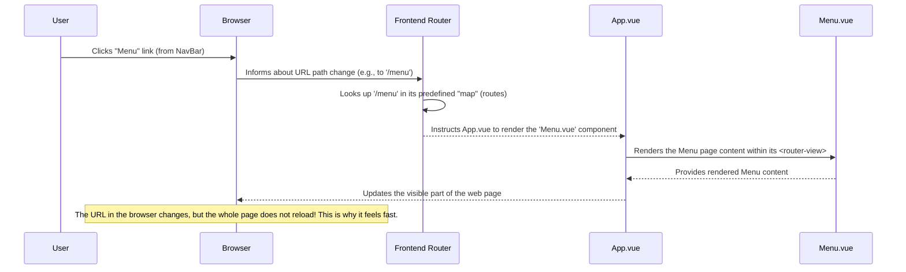

# Chapter 1: Frontend Router

Welcome to the `OrderSystem` project! In this first chapter, we're going to explore a fundamental concept that makes our application feel fast and smooth: the **Frontend Router**.

### What Problem Does the Frontend Router Solve?

Imagine you're using a modern app on your phone or computer. When you tap on different sections, it usually switches instantly without a long loading screen. Our `OrderSystem` aims for that same "desktop-like" experience on the web.

Traditionally, when you click a link on a website, your browser fetches an entirely new page from the server, causing a brief blank screen or a "page reload." This isn't ideal for a snappy app feel.

This is where the **Frontend Router** comes in! It's like an intelligent tour guide for our application. Instead of asking the browser to load a whole new map (website) every time you want to go to a different place (page), the Frontend Router already has the entire map downloaded. When you choose a new destination, it just *shows* you that part of the map instantly, without leaving the current map.

**Our Central Use Case:** You're on our `OrderSystem`'s main page, and you want to see the delicious dishes. You click on the "Menu" link in the navigation bar. The Frontend Router's job is to ensure that the "Menu" page appears instantly without the entire browser refreshing.

### Key Concepts

Let's break down the main ideas behind the Frontend Router:

1.  **URL Path:** This is the part of the web address that tells the browser *where* you are within the website (e.g., `/menu`, `/login`, `/cart`). It's like a street address within our app city.
2.  **Vue Component (Page):** In our `OrderSystem`, each "page" (like the Menu, Login, or Cart) is built using something called a "Vue Component." Think of these as individual, self-contained display units for different sections of our app.
3.  **Navigation:** This simply means moving from one Vue Component (page) to another within our single-page application.

The Frontend Router defines a clear connection: "If the URL path is X, then show Vue Component Y."

### How to Use the Frontend Router (Our "Menu" Use Case)

Let's see how our `OrderSystem` uses the Frontend Router to display the Menu page when you click its link.

In our application's navigation bar (managed by a component called `NavBar`), when you click a link like "Menu", it doesn't use a standard `<a href="...">` HTML tag. Instead, it uses a special Vue Router component called `router-link`.

Here's a simplified look at how it might appear in the `NavBar` component:

```html
<router-link to="/menu" class="logo">
  <!-- This is the logo image and text for the Menu link -->
</router-link>
<router-link to="/menu">
  <!-- This is the text for the Menu link -->
</router-link>
```
*Explanation:*
-   The `<router-link>` component is specifically designed for navigation within our Vue application.
-   The `to="/menu"` part tells the Frontend Router: "When this link is clicked, change the URL path to `/menu`."

Now, where does the "Menu" page actually show up? There's another special component, `router-view`, in our main application file (`App.vue`). This component acts as a placeholder. Whatever Vue component the Frontend Router decides to show for the current URL path gets rendered inside this `router-view`.

Here's how `App.vue` uses `router-view`:

```html
<!-- In frontend/src/App.vue -->
<template>
  <div>
    <!-- Other components like NavBar and FooterComponent might be here -->
    <NavBar />
    <div class="auth-wrapper">
      <div class="auth-inner">
        <router-view /> <!-- This is the magic spot! -->
      </div>
    </div>
    <FooterComponent />
  </div>
</template>
```
*Explanation:*
-   The `<router-view />` component is a dynamic area.
-   When you click the "Menu" link, the Frontend Router notices the path change to `/menu`, looks up which component matches that path (it's the `Menu.vue` component in our case), and then tells the `<router-view>` to display the `Menu.vue` component's content. All of this happens without a full page reload!

### What Happens Under the Hood? (Internal Implementation)

Let's use an analogy: Imagine our `OrderSystem` as a restaurant with different rooms: a "Menu Room," a "Login Room," a "Cart Room," and so on. The **Frontend Router** is like the Maitre D' (host).

When you enter the restaurant, the Maitre D' has a floor plan (the `routes` configuration). If you say, "I want to go to the Menu Room," the Maitre D' quickly checks the floor plan, guides you to the right place, and changes the sign on the door (the URL path) to indicate you're in the "Menu Room." All of this happens within the same building, without you having to leave and re-enter.

Here's a simplified sequence of events when you click the "Menu" link:



### The Router's Code Setup

The "map" (or `routes` configuration) for our Frontend Router is defined in `frontend/src/router/index.js`. This file is where we tell our application which Vue component to show for each specific URL path.

```javascript
// In frontend/src/router/index.js
import { createWebHashHistory, createRouter } from "vue-router";
import Login from '../pages/Login.vue';
import Register from '../pages/Register.vue';
import Menu from '../pages/Menu.vue';
// ... other page imports ...
import Dashboard from '../admin/Dashboard.vue';

const routes = [
  {
    path: "/", // The root URL path
    name: "Menu",
    component: Menu, // The Vue component to display
  },
  {
    path: "/menu", // Another path for the menu page
    name: "Menu",
    component: Menu,
  },
  {
    path: "/login",
    name: "Login",
    component: Login,
  },
  // ... more route definitions for other pages ...
  {
    path: "/admin/dashboard",
    name: "Dashboard",
    component: Dashboard,
  },
  {
    path: '/:pathMatch(.*)*', // A special route to catch any undefined paths
    component: Menu, // If an unknown path is entered, show the Menu page
  },
];

const router = createRouter({
  history: createWebHashHistory(), // Tells the router how to manage browser history (using '#' in URLs)
  routes, // Our map of URL paths to components
});

export default router; // Make our configured router available to the rest of the app
```
*Explanation:*
-   The `routes` array is the core of our router's "map." Each object in this array links a `path` (the URL part) to a `component` (the Vue file that represents that page).
-   `createWebHashHistory()` is a function from the `vue-router` library that helps manage browser history without requiring special server setup. It uses a `#` symbol in the URL (e.g., `mysite.com/#/menu`).
-   `createRouter()` creates the actual router instance using our defined `routes`.
-   Finally, `export default router;` makes this configured router available to our main application.

Our main application entry point, `frontend/src/main.js`, then "uses" this router:

```javascript
// In frontend/src/main.js
import { createApp } from 'vue'
import App from './App.vue'
import router from './router' // Import our configured router
import store from './store'
import "@/axios"

createApp(App)
  .use(router) // Tell our Vue app to use the router
  .use(store)
  .mount('#app')
```
*Explanation:*
-   The line `import router from './router'` brings our router configuration into the main application.
-   The `.use(router)` part connects our router to the entire Vue application, making `router-link` and `router-view` work, and enabling navigation.

### Conclusion

The Frontend Router is a crucial part of building modern web applications like our `OrderSystem`. It allows us to:
-   **Manage navigation** between different "pages" (Vue components).
-   Provide a **smooth, app-like experience** by avoiding full page reloads.
-   **Map URL paths** (like `/menu` or `/login`) to the specific content that should be displayed.

Now that we understand how our application knows *where* to go, the next step is to understand *what data* it shows on those pages. In the next chapter, we'll dive into the [Vuex Store (Central Frontend Data Store)](02_vuex_store__central_frontend_data_store__.md), which acts as the central brain for all the information our frontend needs.

---

<sub><sup>Generated by [AI Codebase Knowledge Builder](https://github.com/The-Pocket/Tutorial-Codebase-Knowledge).</sup></sub> <sub><sup>**References**: [[1]](https://github.com/kuryudesu/OrderSystem/blob/01f52feb1b4ca4685d272f4a74adb2bb997f06bb/backend/public/js/app.cfae5d50.js), [[2]](https://github.com/kuryudesu/OrderSystem/blob/01f52feb1b4ca4685d272f4a74adb2bb997f06bb/frontend/src/main.js), [[3]](https://github.com/kuryudesu/OrderSystem/blob/01f52feb1b4ca4685d272f4a74adb2bb997f06bb/frontend/src/router/index.js)</sup></sub>
