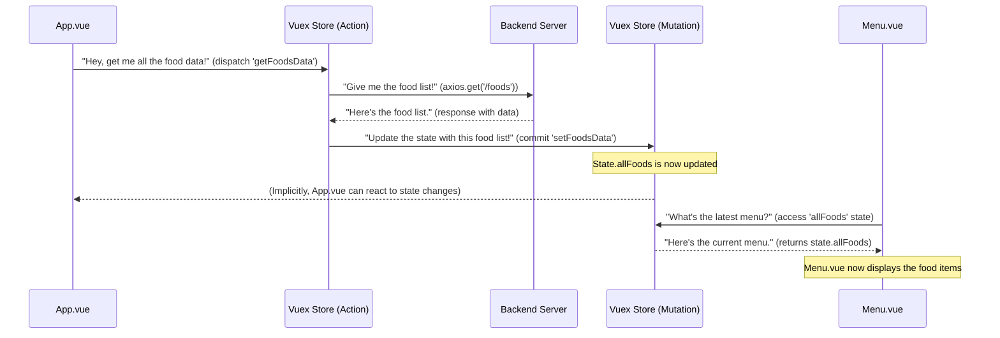

# Chapter 2: Vuex Store (Central Frontend Data Store)

Welcome back to the `OrderSystem` project! In the [previous chapter](01_frontend_router_.md), we learned how the Frontend Router helps our application navigate between different pages smoothly, like an expert tour guide. But what about the information displayed on those pages? How does our application manage all the important data, like the list of dishes on the menu or who is currently logged in?

This is where the **Vuex Store** comes in! It's like the central brain for all the information our frontend application needs to keep track of.

### What Problem Does the Vuex Store Solve?

Imagine our `OrderSystem` is a bustling restaurant. Different parts of the restaurant need to know the same critical information:
*   What's on today's menu?
*   Is a customer logged in? If so, who are they?
*   What items are in their shopping cart?

Without a central system, each waiter (component) might try to keep track of this information on their own, or pass notes (data) to each other. This quickly gets messy! If the menu changes, how do all the waiters instantly know? If a customer logs in, how do all parts of the app update to show their name or specific cart?

This is the problem the **Vuex Store** solves. It provides a **centralized place for all shared data** in our frontend application. Think of it as a huge, well-organized bulletin board in the kitchen where everyone can write important updates and read the latest information. This ensures that every part of our application always has the most up-to-date and consistent data.

**Our Central Use Case:** When you first open our `OrderSystem` or go to the "Menu" page, we need to display a list of all available food items. This food data comes from our backend server (which we'll cover later!). The Vuex Store's job is to fetch this data once, store it centrally, and then make it easily available to the Menu page (and any other part of the app that needs to know about food items). Similarly, when a user logs in, their information is stored here, accessible globally.

### Key Concepts

Let's break down the main ideas behind the Vuex Store:

1.  **State (The Data)**: This is the actual shared data itself. It's the "information" on our central bulletin board. In our `OrderSystem`, this includes things like:
    *   `allFoods`: The complete list of all dishes available.
    *   `user`: Information about the currently logged-in customer.
    *   `admin`: Details if an admin is logged in.

2.  **Mutations (Changing the Data)**: These are the *only* official way to change the `State`. Think of them as special "update forms" for the bulletin board. You can't just scribble on the board; you have to fill out a mutation form. This makes sure all changes are tracked and done in a predictable way. Mutations are always synchronous (they happen immediately).

3.  **Actions (Doing the Work)**: Actions are like "tasks" that interact with the store. They can contain asynchronous operations (like fetching data from a server, which takes time). Once an action finishes its work, it **commits** a mutation to actually change the state. So, an action might say, "Go fetch the menu from the chef (server)," and once the menu arrives, it "fills out a mutation form to update the `allFoods` state."

### How to Use the Vuex Store (Our "Menu" Use Case)

Let's see how our `OrderSystem` uses the Vuex Store to get and display the menu items.

When our `App.vue` (the main component) starts, it needs to fetch all the food data. It uses an **Action** to do this.

```javascript
// In frontend/src/App.vue (simplified)
import { mapActions } from 'vuex'; // Helper to easily use actions

export default {
  // ... other component options ...
  created() {
    // When the app is created, dispatch the action to get food data
    this.getFoodsData();
  },
  methods: {
    // Map the 'getFoodsData' action from the store to this component's methods
    ...mapActions(['getFoodsData']),
  }
};
```
*Explanation:*
-   `mapActions` is a helper from Vuex that lets us easily use actions defined in our store as if they were regular methods in our component.
-   When `this.getFoodsData()` is called in `created()`, it tells the Vuex Store to run the `getFoodsData` action. This action will then fetch the food data from the server.

Now, how does the `Menu.vue` component (or any other component) actually *get* the `allFoods` data to display it? It uses a **State** property directly.

```javascript
// In frontend/src/Menu.vue (simplified)
import { mapState } from 'vuex'; // Helper to easily access state

export default {
  // ... other component options ...
  computed: {
    // Map the 'allFoods' state from the store to a computed property
    ...mapState(['allFoods']),
    // filterFoods will now automatically get the latest allFoods from the store
    filterFoods() {
      // ... logic to filter and display foods from this.allFoods ...
      return this.allFoods.filter(/* ... */);
    }
  }
};
```
*Explanation:*
-   `mapState` is a helper from Vuex that lets us easily use state properties from our store as if they were computed properties in our component.
-   `this.allFoods` will now always reflect the most current `allFoods` data stored in our Vuex Store. If the state changes (e.g., new food items are added), `Menu.vue` automatically updates!

### What Happens Under the Hood? (Internal Implementation)

Let's use our restaurant analogy again:

Imagine the **Vuex Store** is the head chef's office.
*   **State** is the daily menu board in that office.
*   **Actions** are requests from the head chef to suppliers (our backend server).
*   **Mutations** are the only way the head chef (or an authorized assistant) can update the menu board.

Here's a simplified sequence of events when our `OrderSystem` loads the menu:



### The Store's Code Setup

The core of our Vuex Store is defined in `frontend/src/store/index.js`. This is where we define our `state`, `mutations`, and `actions`.

```javascript
// In frontend/src/store/index.js
import { createStore } from "vuex"; // Vuex's main function
import axios from "axios"; // To make API calls

const store = createStore({
    // 1. State: Our central data hub
    state() {
        return {
            allFoods: [], // Array to hold all food items
            user: undefined, // Holds logged-in user info
            staff: undefined, // Holds logged-in staff info
            admin: undefined, // Holds logged-in admin info
        }
    },
    // 2. Mutations: The ONLY way to change state (synchronous)
    mutations: {
        setFoodsData(state, payload){
            state.allFoods = payload; // Update allFoods with new data
        },
        setUser(state, payload){
            state.user = payload; // Update user info
        },
        // ... other mutations for staff, admin, etc.
    },
    // 3. Actions: Perform operations, commit mutations (can be asynchronous)
    actions: {
        async getFoodsData(context){ // Context gives access to commit, state, etc.
            await axios.get('/foods') // Make an API call to get food data
            .then(function (response) {
                // Once data is received, commit a mutation to update state
                context.commit("setFoodsData", response.data);
            })
            .catch(function (error) {
                console.log(error); // Log any errors
            });
        },
    }
});

export default store; // Make our configured store available to the rest of the app
```
*Explanation:*
-   `createStore()` initializes our Vuex store.
-   The `state` function returns an object containing all our shared data. `allFoods` starts as an empty array.
-   `mutations` contains functions like `setFoodsData` and `setUser`. These functions directly modify the `state`. They always take `state` as the first argument and a `payload` (the data to update with) as the second.
-   `actions` contains functions like `getFoodsData`. This action uses `axios` (an HTTP client for making API requests) to fetch data from `/foods`. Once the data is successfully received (`.then`), it calls `context.commit("setFoodsData", response.data)` to trigger the `setFoodsData` mutation, updating `state.allFoods`.

Finally, just like with the router, our main application entry point, `frontend/src/main.js`, needs to tell Vue to "use" this store:

```javascript
// In frontend/src/main.js
import { createApp } from 'vue'
import App from './App.vue'
import router from './router'
import store from './store' // Import our configured store
import "@/axios"

createApp(App)
  .use(router)
  .use(store) // Tell our Vue app to use the store
  .mount('#app')
```
*Explanation:*
-   The line `import store from './store'` brings our store configuration into the main application.
-   The `.use(store)` part connects our Vuex Store to the entire Vue application, making `state`, `mutations`, and `actions` accessible from any component.

### Conclusion

The Vuex Store is essential for managing shared data in our `OrderSystem` frontend. It allows us to:
-   **Centralize data** (`state`) that many components need.
-   **Control how data is changed** (through `mutations`) for better predictability and debugging.
-   **Perform asynchronous operations** (like fetching data from our [Backend Application Server](03_backend_application_server_.md)) using `actions`.
-   Ensure all parts of our application have a **consistent view** of the data.

Now that we understand how our frontend application manages its internal data, it's time to see where that data actually comes from. In the next chapter, we'll journey to the server side and explore the [Backend Application Server](03_backend_application_server_.md)!

---

<sub><sup>Generated by [AI Codebase Knowledge Builder](https://github.com/The-Pocket/Tutorial-Codebase-Knowledge).</sup></sub> <sub><sup>**References**: [[1]](https://github.com/kuryudesu/OrderSystem/blob/01f52feb1b4ca4685d272f4a74adb2bb997f06bb/backend/public/js/app.cfae5d50.js), [[2]](https://github.com/kuryudesu/OrderSystem/blob/01f52feb1b4ca4685d272f4a74adb2bb997f06bb/frontend/src/main.js), [[3]](https://github.com/kuryudesu/OrderSystem/blob/01f52feb1b4ca4685d272f4a74adb2bb997f06bb/frontend/src/store/index.js)</sup></sub>
