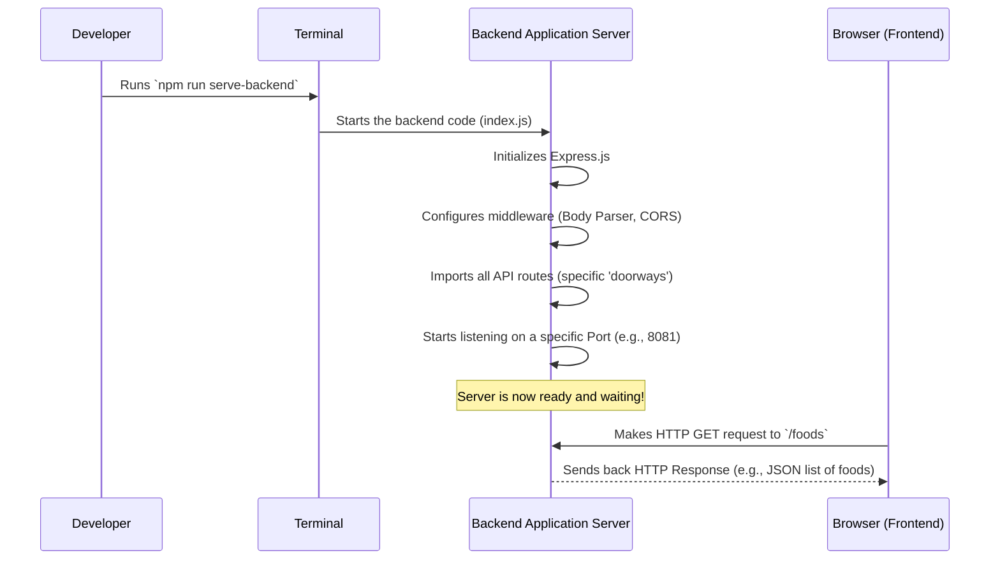

# Chapter 3: Backend Application Server

Welcome back to the `OrderSystem` project! In our [previous chapter](02_vuex_store__central_frontend_data_store__.md), we learned about the Vuex Store, which is like the central brain for all the information our *frontend* application needs. It holds data like the list of menu items and user details. But where does all that important data come from in the first place? It certainly doesn't magically appear!

This is where the **Backend Application Server** comes into play. It's the "engine" that powers our entire backend system.

### What Problem Does the Backend Application Server Solve?

Imagine our `OrderSystem`'s frontend (the part you see and interact with) as a customer in a restaurant. This customer (our frontend) wants to do things like:

*   "Show me the menu!"
*   "I want to log in as a user."
*   "Place this order for me."

Our frontend can't fulfill these requests on its own because the real, up-to-date menu, the user accounts, and the order processing logic all live on a different computer – the **server**.

The **Backend Application Server** is like the main office and kitchen of our restaurant. It sits there, always ready, listening for requests from customers (our frontend). When a request comes in, it processes it (like fetching the menu from the database or checking login details) and then sends back an answer. Without this server, our frontend would be an empty shell, unable to get any real information or perform any actions.

**Our Central Use Case:** When you visit the "Menu" page of our `OrderSystem`, the frontend needs to fetch the list of available dishes. The Backend Application Server's job is to be running, receive that request, find the dish information, and send it back to the frontend so it can be displayed. It's the essential link between our user interface and the actual data.

### Key Concepts

Let's break down the main ideas behind the Backend Application Server:

1.  **HTTP Requests and Responses:** This is how the frontend and backend talk. The frontend sends an **HTTP Request** (like saying, "Hey, I need the menu!"). The backend processes it and sends back an **HTTP Response** (like saying, "Here's the menu!"). This communication uses standard web language (HTTP).
2.  **Express.js:** This is a popular "framework" in Node.js (which is the environment our backend code runs in). Think of Express.js as a set of tools and rules that make it much easier to build our Backend Application Server, letting it understand requests and send responses efficiently.
3.  **Middleware:** These are small helper functions that can do something with an incoming request *before* it gets to its final destination. They're like security checks or translators.
    *   **Body Parser:** Our frontend often sends data in a special format called JSON (JavaScript Object Notation). Body Parser is like a translator that helps our server understand and use this JSON data in the request.
    *   **CORS (Cross-Origin Resource Sharing):** Our frontend and backend often live at different web addresses (e.g., `localhost:8080` for frontend, `localhost:8081` for backend). Without CORS, web browsers would block them from talking to each other for security reasons. CORS is like giving permission for them to communicate.
4.  **API Routes:** These are specific "doorways" or addresses on our server that correspond to different actions. For example, there might be a route `/foods` to get the menu, `/login` to log in, or `/order` to place an order.
5.  **Port:** This is a specific "channel number" on the computer where our server is listening for incoming requests. Just like a radio station broadcasts on a specific frequency, our server listens on a specific port (e.g., `8081`).

### How to Start the Backend Application Server (Our "Menu" Use Case)

For our frontend to fetch the menu, the Backend Application Server first needs to be **running and ready to listen**.

Imagine our server as a restaurant. Before customers can order, the restaurant needs to:
1.  Open its doors.
2.  Set up its counter.
3.  Have its menu (routes) ready.
4.  Turn on its "OPEN" sign and tell everyone its address and operating hours (port).

In our `OrderSystem`, this involves a main file that brings everything together and starts the listening process.

Once the server is running, when the frontend (from [Chapter 2: Vuex Store](02_vuex_store__central_frontend_data_store__.md)) dispatches an action to `getFoodsData`, it sends an HTTP request to the Backend Application Server, specifically to the `/foods` route. Our Backend Application Server, because it's running and configured, will receive this request.

### What Happens Under the Hood? (Internal Implementation)

Let's see the sequence of events when our Backend Application Server starts and prepares to handle requests:



The main file that performs all these startup actions is `backend/index.js`. Let's look at its key parts, broken down for clarity.

First, we import the necessary tools:

```javascript
// In backend/index.js (Part 1: Imports)

// import express - is for building the Rest apis
import express from "express";

// import body-parser - helps to parse the request and create the req.body object
import bodyParser from "body-parser";

// import cors - provides Express middleware to enable CORS with various options, connect frontend
import cors from "cors";

// import routes - our specific API rules (covered in next chapter!)
import router from "./routes/routes.js";
```
*Explanation:*
-   `express` is imported because it's our core tool for building the server.
-   `body-parser` and `cors` are imported because they are the middleware we need for handling common request tasks.
-   `router` is imported. This is where we'll define all the specific "doorways" (API routes) for our backend, like `/foods` or `/login`. We'll explore this in detail in the [next chapter](04_api_route_manager_.md)!

Next, we set up our Express application and configure the middleware:

```javascript
// In backend/index.js (Part 2: Setup Express and Middleware)

// init express
const app = express();

// use express json (via body-parser) - helps server understand JSON data in requests
app.use(bodyParser.json());
app.use(bodyParser.urlencoded({ extended: true }));

// use cors - allows our frontend (from a different address) to talk to this backend
app.use(cors());

// use router - connect all our specific API routes to the main application
app.use(router);
```
*Explanation:*
-   `const app = express();` creates our actual Express application. Think of this as getting the main building structure ready.
-   `app.use(bodyParser.json());` and `app.use(bodyParser.urlencoded({ extended: true }));` tell Express to use the Body Parser middleware. This means that if our frontend sends data in JSON format, our server will automatically understand it and make it available in a `req.body` object (e.g., when logging in, the server can read the username and password from `req.body`).
-   `app.use(cors());` enables the CORS middleware. This is very important for local development, as it prevents web browsers from blocking communication between our frontend (likely on `localhost:8080`) and backend (likely on `localhost:8081`).
-   `app.use(router);` is where we tell our Express app to use all the API routes we defined in `routes.js`. It's like hanging up the restaurant's menu with all the specific dishes and their instructions.

Finally, we tell our server to start listening for incoming requests:

```javascript
// In backend/index.js (Part 3: Start Listening)

// A simple default route for the root '/' path
app.get('/', function(req, res){
    res.json({ message: 'Welcome to restaurant api' });
});

// Define the PORT where our server will listen
const PORT = process.env.PORT || 8081;

// Start the server! Listen for requests on the specified PORT.
app.listen(PORT, () => {
  console.log(`Server is running on port ${PORT}.`);
});
```
*Explanation:*
-   `app.get('/', ...)` defines a very basic "hello world" route. If someone visits the root address of our server (e.g., `http://localhost:8081/`), it will send back a JSON message.
-   `const PORT = process.env.PORT || 8081;` sets the port number. It tries to use a port defined in the environment (common for deployment) or defaults to `8081`.
-   `app.listen(PORT, () => { ... });` is the most important line! This is what actually starts our Backend Application Server. It tells the server to sit on port `8081` (or whatever `PORT` is) and wait for HTTP requests. Once this line runs, our server is "open for business" and ready to receive requests from the frontend or any other client. The message in the `console.log` appears in your terminal, confirming the server has started.

### Conclusion

The Backend Application Server is the foundation of our `OrderSystem`'s backend. It's the "engine" that:
-   **Starts up** and gets the backend ready.
-   **Listens** for incoming HTTP requests from the frontend.
-   **Configures essential tools** (middleware like Body Parser and CORS) to properly handle requests.
-   **Hooks in all the specific API routes** (which we'll explore next!) that define what the server can actually *do*.

Now that we understand how our server starts and listens, the next logical step is to understand how it decides *what to do* when a specific request (like "give me the menu") comes in. In the next chapter, we'll dive into the [API Route Manager](04_api_route_manager_.md), which defines all the specific "doorways" and rules for our server!

---

<sub><sup>Generated by [AI Codebase Knowledge Builder](https://github.com/The-Pocket/Tutorial-Codebase-Knowledge).</sup></sub> <sub><sup>**References**: [[1]](https://github.com/kuryudesu/OrderSystem/blob/01f52feb1b4ca4685d272f4a74adb2bb997f06bb/backend/index.js)</sup></sub>
