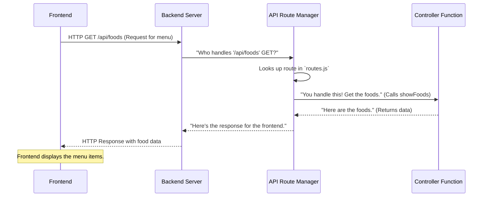

# Chapter 4: API Route Manager

Welcome back to the `OrderSystem` project! In our [previous chapter](03_backend_application_server_.md), we got our Backend Application Server up and running. It's like we've opened the doors to our restaurant's kitchen and office. It's listening for requests on a specific port, ready to do work. But how does it know *what kind of work* to do when a request comes in? How does it differentiate between a request to "get the menu" versus a request to "log in a user"?

This is where the **API Route Manager** steps in! It's the traffic controller for all requests coming into our backend, making sure each one goes to the correct place.

### What Problem Does the API Route Manager Solve?

Imagine our Backend Application Server (the main office and kitchen) as a busy restaurant. Customers (our frontend application) keep coming in with various requests:

*   "I want to see the list of all available food items."
*   "I want to log in with my username and password."
*   "Please add this item to my cart."
*   "I need to update my profile."

Without a clear system, the kitchen staff would be confused, not knowing who should handle which request or even if they *can* handle a specific request.

The **API Route Manager** solves this by acting as the restaurant's hostess (or a well-organized menu board). It defines all the available "doorways" (API endpoints) into our backend, what kind of request each doorway expects (e.g., just looking, or submitting new info), and who inside the kitchen (a specific controller function) is responsible for handling that particular request. It ensures every request goes to the correct handler.

**Our Central Use Case:** When the frontend (as we saw in [Chapter 2: Vuex Store](02_vuex_store__central_frontend_data_store__.md)) dispatches an action to `getFoodsData`, it sends an HTTP GET request to `/api/foods`. The API Route Manager's job is to receive this specific request, identify it as a "get all food items" request, and send it to the exact piece of code that knows how to fetch and return the list of food items.

### Key Concepts

Let's break down the main ideas behind the API Route Manager:

1.  **API Endpoint (or Route):** This is a specific address or path on our server that represents an action or a resource. It's like a specific dish on the menu. Examples: `/api/foods`, `/api/users/:email`, `/api/cartItem`.
2.  **HTTP Method:** This tells the server *what kind of action* the client wants to perform on the endpoint. Think of it as how you interact with the menu item.
    *   **GET:** You want to *get* (read) data. (e.g., "Show me the menu.")
    *   **POST:** You want to *create* new data. (e.g., "Add this new dish to the menu," or "Create a new user account.")
    *   **PUT:** You want to *update* existing data. (e.g., "Change the price of this dish.")
    *   **DELETE:** You want to *remove* data. (e.g., "Remove this dish from the menu.")
3.  **Controller Function (or Handler):** This is the actual block of code that performs the specific logic for an API endpoint. It's the chef in the kitchen who knows how to prepare a specific dish. For example, a `showFoods` controller function knows how to retrieve all food items from the database. (We'll dive deeper into these functions in the [next chapter](05_backend_logic_handlers__controllers_.md)!)
4.  **Express Router:** This is a special tool provided by Express.js (our backend framework) that helps us organize and define all our API endpoints and their corresponding controller functions.

### How to Use the API Route Manager (Our "Menu" Use Case)

Let's look at how our API Route Manager is set up to handle the request to "get all food items" (`GET /api/foods`).

In our `backend/routes/routes.js` file, the API Route Manager defines a rule that says: "If you get a **GET** request for the path `/api/foods`, then run the `showFoods` function."

Here's how that rule looks:

```javascript
// In backend/routes/routes.js (simplified)

// 1. Import the Express Router
import express from "express";

// 2. Import the function that will handle the request
import { showFoods } from "../controllers/food.js";

// 3. Create a new Express Router instance
const router = express.Router();

// 4. Define the route:
//    - When a GET request comes to "/api/foods"
//    - Call the 'showFoods' function to handle it
router.get("/api/foods", showFoods);

// export default router - makes this router available to index.js
// ... (other routes are defined here, but hidden for simplicity) ...
export default router;
```
*Explanation:*
-   `import express from "express";` brings in the Express library, which includes the `Router` feature.
-   `import { showFoods } from "../controllers/food.js";` brings in the actual logic function (`showFoods`) from another file. This function is the "chef" who knows how to get the food data.
-   `const router = express.Router();` creates our "API Route Manager" instance.
-   `router.get("/api/foods", showFoods);` is the core.
    *   `router.get(...)`: This specifies that we're defining a route for an HTTP **GET** request.
    *   `"/api/foods"`: This is the specific API endpoint (the address) we're defining.
    *   `showFoods`: This is the **controller function** that will be executed when a GET request hits `/api/foods`.

So, when our frontend (from [Chapter 2: Vuex Store](02_vuex_store__central_frontend_data_store__.md)) sends an HTTP GET request to `http://localhost:8081/api/foods`, this specific line of code is what tells our backend server to execute the `showFoods` function.

### What Happens Under the Hood? (Internal Implementation)

Let's go back to our restaurant analogy:

The **API Route Manager** is like the restaurant's hostess holding the main menu and floor plan.

When a customer (our **Frontend**) arrives at the restaurant (our **Backend Application Server**) and says, "I'd like to see the menu of all available food dishes" (sends an HTTP **GET** request to `/api/foods`):

1.  The **Backend Application Server** receives the request.
2.  It hands the request over to the **API Route Manager** (the hostess).
3.  The **API Route Manager** looks at the request: "It's a GET request for `/api/foods`."
4.  It checks its "menu and floor plan" (`backend/routes/routes.js`). It finds the matching entry: `router.get("/api/foods", showFoods);`.
5.  It then directs the request to the specific "chef" (`showFoods` **Controller Function**) who is responsible for handling "get all food items."
6.  The "chef" (`showFoods`) prepares the response (fetches food data, which we'll see how in the next chapter).
7.  The "chef" gives the prepared food data back to the **API Route Manager**.
8.  The **API Route Manager** passes it back to the **Backend Application Server**.
9.  The **Backend Application Server** sends the food data as an HTTP Response back to the **Frontend**.

Here's how this looks in a sequence diagram:



### The Router's Code Setup (Deep Dive)

The core of our API Route Manager is defined in `backend/routes/routes.js`.

First, we need to import `express` to use its `Router` feature and import the specific controller functions that will handle our requests.

```javascript
// In backend/routes/routes.js

// import express - to use its Router feature
import express from "express";

// import functions from controller that will handle the logic
import {
    showFoods, // Handles getting all foods
    createFood, // Handles creating a new food
    // ... other food related functions
} from "../controllers/food.js";

import {
    showAUser, // Handles getting a user by email
    // ... other user related functions
} from "../controllers/user.js";

// ... other imports for different controllers (staff, cart, etc.) ...
```
*Explanation:*
-   `import express from "express";` is essential to access the `Router` object.
-   We then import specific functions like `showFoods`, `createFood`, and `showAUser` from their respective "controller" files (e.g., `food.js`, `user.js`). These are our "chefs" ready to prepare specific "dishes" (handle specific requests).

Next, we initialize the router and define our API endpoints:

```javascript
// In backend/routes/routes.js

// init express router
const router = express.Router();

////////////////////////// FOOD ////////////////////////////////
// get all Food - GET /api/foods
router.get("/api/foods", showFoods);

// create Food - POST /api/foods
router.post("/api/foods", createFood);

// update Food - PUT /api/foods/:id (The ':id' means we expect a food ID in the URL)
router.put("/api/foods/:id", /* updateFood function here */);

// delete Food - DELETE /api/foods/:id
router.delete("/api/foods/:id", /* deleteFood function here */);


////////////////////////// USER ////////////////////////////////
// get A user - GET /api/users/:email
router.get("/api/users/:email", showAUser);

// create account - POST /api/users/
router.post("/api/users/", /* createAccount function here */);

// ... many more routes for staff, cart, booking, etc. ...

// export default router - make this configured router available
export default router;
```
*Explanation:*
-   `const router = express.Router();` creates our instance of the API Route Manager.
-   Each `router.METHOD("/api/path", handlerFunction);` line maps a specific HTTP method (e.g., `.get`, `.post`) and URL path (e.g., `"/api/foods"`) to a corresponding controller function (e.g., `showFoods`).
-   Notice how paths can include dynamic parts like `:id` or `:email`. This means the server expects a specific ID or email in that part of the URL, which the `handlerFunction` can then use.

Finally, remember from [Chapter 3: Backend Application Server](03_backend_application_server_.md) that our main server file, `backend/index.js`, needs to know about and use this `router`:

```javascript
// In backend/index.js (simplified)

// import router from "./routes/routes.js"; // Import our configured API Route Manager

// ... other setup ...

// use router - connect all our specific API routes to the main application
app.use(router); // Tell the server to use our route definitions

// ... server listening ...
```
*Explanation:*
-   The line `import router from "./routes/routes.js";` brings our API Route Manager into the main application server.
-   `app.use(router);` tells the Express application to use all the routes we've defined in `routes.js`. This is how the server "knows" what requests to handle and which controller functions to call.

### Conclusion

The API Route Manager is a vital component of our `OrderSystem`'s backend. It acts as the intelligent traffic controller, enabling our server to:
-   **Define clear API endpoints** (addresses) for different actions.
-   **Map specific HTTP requests** (GET, POST, PUT, DELETE) to the correct controller functions.
-   **Organize our backend logic**, making it easy to understand what our server can do and how.

Now that we understand *where* incoming requests go, the next logical step is to understand *how* those requests are actually handled. In the next chapter, we'll dive into the [Backend Logic Handlers (Controllers)](05_backend_logic_handlers__controllers_.md), which are the "chefs" that do the actual work for each API endpoint!

---

<sub><sup>Generated by [AI Codebase Knowledge Builder](https://github.com/The-Pocket/Tutorial-Codebase-Knowledge).</sup></sub> <sub><sup>**References**: [[1]](https://github.com/kuryudesu/OrderSystem/blob/01f52feb1b4ca4685d272f4a74adb2bb997f06bb/backend/index.js), [[2]](https://github.com/kuryudesu/OrderSystem/blob/01f52feb1b4ca4685d272f4a74adb2bb997f06bb/backend/routes/routes.js)</sup></sub>
© 2025 Codebase to Tutorial. All rights reserved.
Terms of Service
