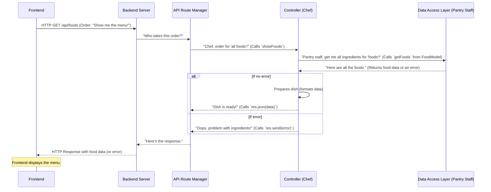

# Chapter 5: Backend Logic Handlers (Controllers)

Welcome back to the `OrderSystem` project! In our [previous chapter](04_api_route_manager_.md), we learned about the API Route Manager, which acts like a traffic controller, directing incoming requests to the correct "doorway" (API endpoint) and knowing *which* specific function should handle it. But what actually happens *inside* that function? Who does the real work of fetching data, processing it, and preparing a response?

This is where **Backend Logic Handlers**, often called **Controllers**, come into play! They are the core brains of our backend, executing the actual business logic for each request.

### What Problem Do Backend Logic Handlers (Controllers) Solve?

Imagine our restaurant again. The [API Route Manager](04_api_route_manager_.md) (the hostess) receives an order from a customer (our frontend) – let's say "I want to see the menu of all available food dishes." The hostess knows *which chef* should handle this request.

The **Controller** is that specific chef in the kitchen. When the order comes to them, they don't just sit there. They:
1.  **Understand the order:** What data does the customer want?
2.  **Gather ingredients:** They interact with the pantry (our database models, which we'll cover later) to get the raw data (like the list of dishes).
3.  **Prepare the dish:** They process or organize this data if needed.
4.  **Send it out:** They package the final "dish" (the response) and send it back.

Without controllers, our API routes would just be empty pathways, unable to perform any useful actions. Controllers bring our backend to life by performing the specific tasks requested by the frontend.

**Our Central Use Case:** When the frontend sends a `GET` request to `/api/foods` (as routed by the [API Route Manager](04_api_route_manager_.md)), a specific controller function named `showFoods` is called. This `showFoods` function is responsible for asking the database for all the food items, and then sending that list back to the frontend.

### Key Concepts

Let's break down the main ideas behind Controllers:

1.  **Request Object (`req`):** When a request comes in, our server receives a `request` object. This object holds all the details about the incoming request:
    *   Any data sent by the frontend (like a username and password for login, found in `req.body`).
    *   Parameters from the URL (like an ID in `/api/foods/:id`, found in `req.params`).
    *   Query parameters from the URL (like `?category=drinks`).
2.  **Response Object (`res`):** This object is how the controller sends information *back* to the frontend. It has methods to:
    *   Send back data (e.g., `res.json(data)`).
    *   Send back status codes (e.g., `res.status(404)` for "not found").
    *   Send error messages (e.g., `res.send(error)`).
3.  **Interacting with Models:** Controllers rarely talk directly to the database. Instead, they interact with specialized functions in our "Models" (which we'll discuss in [Chapter 7: Data Access Layer (Models)](07_data_access_layer__models__.md)). Models are like the pantry staff who know exactly how to get specific ingredients (data) from the database.
4.  **Business Logic:** This is the specific set of rules and steps a controller follows to fulfill a request. For example, for a login request, the business logic might be: "receive username and password, ask the model to find the user, compare passwords, if successful, create a token, and send it back."

### How to Use Backend Logic Handlers (Our "Menu" Use Case)

Let's see how our `OrderSystem` uses a controller function to get and display the menu items when a `GET /api/foods` request arrives.

As we saw in the [previous chapter](04_api_route_manager_.md), the route `router.get("/api/foods", showFoods);` tells Express to call the `showFoods` function.

Here's a simplified version of the `showFoods` controller function:

```javascript
// In backend/controllers/food.js (simplified)

// We import functions from our Food Model, which will handle database interaction
import { getFoods } from "../models/FoodModel.js";

// This is our 'showFoods' controller function
export const showFoods = (req, res) => {
    // 1. We ask the FoodModel to 'getFoods' (fetch all food items)
    //    It uses a callback: (err, results) => { ... }
    getFoods((err, results) => {
        // 2. Check if there was an error from the model/database
        if (err) {
            res.send(err); // If error, send the error back to the frontend
        } else {
            // 3. If successful, send the results (food data) back as JSON
            res.json(results);
        }
    });
};
```
*Explanation:*
-   `export const showFoods = (req, res) => { ... };` defines our controller function. It takes two important arguments: `req` (the request object) and `res` (the response object).
-   `getFoods(...)` is a function from our `FoodModel`. This is where we delegate the task of *actually getting* the food data from the database.
-   The `(err, results) => { ... }` is a "callback" function. Once `getFoods` finishes its work (either successfully or with an error), it calls this function:
    *   If there's an `err`, it means something went wrong (e.g., database connection issue). We then use `res.send(err)` to send that error back to the frontend.
    *   If successful, `results` will contain the list of food items. We then use `res.json(results)` to send this data back to the frontend in a structured JSON format.

So, when the frontend sends a `GET /api/foods` request, this `showFoods` function runs, gets the data, and sends it back.

### What Happens Under the Hood? (Internal Implementation)

Let's use our restaurant analogy one last time, focusing on the role of the Controller (the chef):



Now let's dive into the actual code files for our controllers. You'll find controller files for different parts of our application, like `food.js`, `user.js`, `cart.js`, etc., all located in the `backend/controllers/` directory.

#### `backend/controllers/food.js` (Example for Food Items)

This file contains all the controller functions related to food items. Each function takes `req` and `res` as arguments and performs a specific action.

```javascript
// In backend/controllers/food.js

// Import the functions we need from the Food Model
import {
    getFoods,        // To get all foods
    getFoodById,     // To get a single food by its ID
    insertFood,      // To add a new food
    updateFoodById,  // To update an existing food
    deleteFoodById,  // To delete a food
} from "../models/FoodModel.js"; // Path to our Food Model

// Controller to get all Foods
export const showFoods = (req, res) => {
    getFoods((err, results) => { // Call the model function
        if (err) {
            res.send(err); // Send error if any
        } else {
            res.json(results); // Send food data as JSON
        }
    });
};

// Controller to get a single Food by ID
export const showFoodById = (req, res) => {
    // req.params.id gets the 'id' from the URL (e.g., /api/foods/123)
    getFoodById(req.params.id, (err, results) => {
        if (err) {
            res.send(err);
        } else {
            res.json(results);
        }
    });
};

// Controller to create a new Food
export const createFood = (req, res) => {
    const data = req.body; // New food data comes from the request body (e.g., JSON sent by frontend)
    insertFood(data, (err, results) => {
        if (err) {
            res.send(err);
        } else {
            res.json(results); // Send back success message or newly created food data
        }
    });
};

// ... (other functions like updateFood, deleteFood would follow a similar pattern) ...
```
*Explanation:*
-   Each exported function (`showFoods`, `showFoodById`, `createFood`, etc.) is a controller.
-   Notice how `showFoodById` uses `req.params.id` to get specific information from the URL.
-   `createFood` uses `req.body` to get the data sent by the frontend (e.g., the name and price of the new food item). This `req.body` is made possible by the `body-parser` middleware we set up in [Chapter 3: Backend Application Server](03_backend_application_server_.md).
-   In all cases, the controller delegates the actual database work to a function imported from `FoodModel.js` and then handles the `err` or `results` to form the `res`ponse.

#### `backend/controllers/user.js` (Example for User Operations)

Similarly, `user.js` handles user-related requests:

```javascript
// In backend/controllers/user.js

// Import functions from the User Model
import {
    getAllUser,
    getUserByEmail,
    insertUser
} from "../models/UserModel.js";

// Controller to get all Users
export const allUsers = (req, res) => {
    getAllUser((err, results) => {
        if (err) {
            res.send(err);
        } else {
            res.json(results);
        }
    });
};

// Controller to get a single user by email
export const showAUser = (req, res) => {
    // req.params.email gets the email from the URL
    getUserByEmail(req.params.email, (err, results) => {
        if (err) {
            res.send(err);
        } else {
            res.json(results);
        }
    });
};

// Controller to create a new user account (e.g., registration)
export const createAccount = (req, res) => {
    const data = req.body; // User's registration data (email, password, etc.)
    insertUser(data, (err, results) => {
        if (err) {
            res.send(err);
        } else {
            res.json(results);
        }
    });
};
```
*Explanation:*
-   The structure is very consistent: import model functions, define controller function, call model function, handle `err` or `results`, send `res`ponse.
-   This consistency makes our backend easy to understand and maintain.

### Conclusion

**Backend Logic Handlers (Controllers)** are the heart of our backend's business logic. They are responsible for:
-   **Receiving requests** (via `req`) as directed by the [API Route Manager](04_api_route_manager_.md).
-   **Interacting with Models** to fetch or modify data.
-   **Processing data** and applying business rules.
-   **Preparing and sending responses** (via `res`) back to the frontend.

They are the active "doers" that make our `OrderSystem` respond intelligently to user actions.

Now that our controllers know *what* to do, they need a way to actually *connect* to the database to get their "ingredients." In the next chapter, we'll explore the [Database Connector](06_database_connector_.md), which is the bridge between our application and the storage system!

---

<sub><sup>Generated by [AI Codebase Knowledge Builder](https://github.com/The-Pocket/Tutorial-Codebase-Knowledge).</sup></sub> <sub><sup>**References**: [[1]](https://github.com/kuryudesu/OrderSystem/blob/01f52feb1b4ca4685d272f4a74adb2bb997f06bb/backend/controllers/billdetails.js), [[2]](https://github.com/kuryudesu/OrderSystem/blob/01f52feb1b4ca4685d272f4a74adb2bb997f06bb/backend/controllers/billstatus.js), [[3]](https://github.com/kuryudesu/OrderSystem/blob/01f52feb1b4ca4685d272f4a74adb2bb997f06bb/backend/controllers/booktable.js), [[4]](https://github.com/kuryudesu/OrderSystem/blob/01f52feb1b4ca4685d272f4a74adb2bb997f06bb/backend/controllers/cart.js), [[5]](https://github.com/kuryudesu/OrderSystem/blob/01f52feb1b4ca4685d272f4a74adb2bb997f06bb/backend/controllers/food.js), [[6]](https://github.com/kuryudesu/OrderSystem/blob/01f52feb1b4ca4685d272f4a74adb2bb997f06bb/backend/controllers/seat.js), [[7]](https://github.com/kuryudesu/OrderSystem/blob/01f52feb1b4ca4685d272f4a74adb2bb997f06bb/backend/controllers/staff.js), [[8]](https://github.com/kuryudesu/OrderSystem/blob/01f52feb1b4ca4685d272f4a74adb2bb997f06bb/backend/controllers/user.js)</sup></sub>
