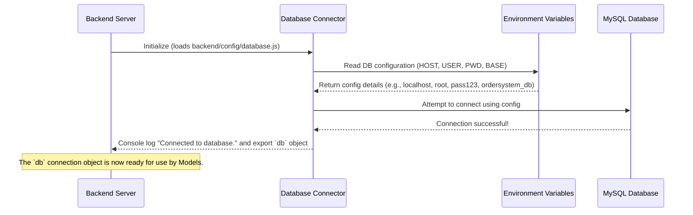

# Chapter 6: Database Connector

Welcome back to the `OrderSystem` project! In our [previous chapter](05_backend_logic_handlers__controllers_.md), we explored **Backend Logic Handlers (Controllers)**. We learned that these "chefs" receive requests, process the logic, and then need to get "ingredients" (data) or store "dishes" (new data). But where do these ingredients actually come from, and where are the finished dishes stored? The answer is our database!

This is where the **Database Connector** comes into play. It's the essential component that allows our application to talk to the database.

### What Problem Does the Database Connector Solve?

Imagine our entire `OrderSystem` application is a house full of appliances (like our controllers and models). These appliances need electricity to work. The **Database Connector** is like the main power cable that connects your house to the electricity grid.

Without this power cable:
*   None of your appliances (controllers, models) can turn on.
*   You can't get electricity (data) from the grid (database).
*   You can't send electricity (new data) back to the grid (database).

Similarly, our application needs to store and retrieve important information like:
*   The list of all available food items.
*   User account details (email, password).
*   Orders placed by customers.

This information lives in a **MySQL database**. The **Database Connector** is responsible for establishing and maintaining the crucial link (the "power cable") between our `OrderSystem` backend and this MySQL database. Without it, our application would be unable to store, retrieve, or update any data, making it essentially useless.

**Our Central Use Case:** When a [Backend Logic Handler (Controller)](05_backend_logic_handlers__controllers_.md) like `showFoods` wants to fetch the list of food items, it eventually needs to *ask the database* for this information. The Database Connector provides the live, active connection to the database, enabling `showFoods` (through the [Data Access Layer (Models)](07_data_access_layer__models_.md)) to send its request and get the menu data back.

### Key Concepts

Let's break down the main ideas behind the Database Connector:

1.  **MySQL Database:** This is the specific type of database system we're using to store all our `OrderSystem`'s data. Think of it as the specific type of "electricity grid" our house is connected to.
2.  **Connection:** This is the active, live link established between our backend application and the MySQL database. It's like plugging in the power cable and turning on the power supply.
3.  **Configuration Details:** To establish a connection, our application needs specific information about the database. This includes:
    *   **Host:** The address of the database server (e.g., `localhost` if it's on the same computer, or a web address).
    *   **User:** The username to log into the database.
    *   **Password:** The password for that user.
    *   **Database:** The specific name of the database within the MySQL server (e.g., `ordersystem_db`).
    These are like knowing the voltage, frequency, and specific outlet type for your power cable.
4.  **Environment Variables:** These are a secure way to store sensitive configuration details (like passwords) outside of our main code files. Instead, they are loaded when the application starts. This is crucial for security, as you don't want to hardcode passwords directly into your code, especially when sharing it. Think of it like a secure, locked box where you keep the sensitive details of your power connection, separate from your house's blueprints.
5.  **`mysql2` library:** This is a special JavaScript "tool" (a library for Node.js) that our application uses to communicate specifically with MySQL databases. It translates our application's requests into a language MySQL understands. This is like having a specific adapter that allows your power cable to fit the MySQL-style outlet.

### How to Use the Database Connector

The Database Connector isn't something our controllers directly "use" in every function call. Instead, it's something that is set up once when our backend application starts. Once configured, it provides a ready-to-use connection object (`db`) that other parts of our backend (specifically the [Data Access Layer (Models)](07_data_access_layer__models_.md)) can import and use to perform database operations.

The "usage" is primarily about making sure the connection is successfully established and then making the `db` connection object available for other modules.

```javascript
// Example: How a Model (from Chapter 7) might "use" the connector
// This snippet is from backend/models/FoodModel.js (conceptually)

import db from "../config/database.js"; // Import our database connection!

export const getFoods = (callback) => {
    // Now we can use the 'db' object to run a query
    db.query("SELECT * FROM food", (err, results) => {
        // This query actually talks to the database via the 'db' connection
        callback(err, results);
    });
};
```
*Explanation:*
-   The line `import db from "../config/database.js";` is how other parts of our application (like the `FoodModel` shown here) get access to the active database connection.
-   The `db.query(...)` method is then used to send SQL commands directly to the database. This only works because `db` represents an *established* and *active* connection provided by our Database Connector.

### What Happens Under the Hood? (Internal Implementation)

Let's trace what happens when our Backend Application Server starts up and initializes the Database Connector. It's like your house's main power system powering up:



The core of our Database Connector is defined in `backend/config/database.js`. This is where all the magic happens:

```javascript
// In backend/config/database.js

import mysql from "mysql2"; // 1. Import the mysql2 library
import dotenv from "dotenv"; // 2. Import dotenv to load environment variables

dotenv.config(); // 3. Load variables from our .env file

// 4. Create the connection object using configuration details
const db = mysql.createConnection({
    host: process.env.DB_HOST,      // Get host from environment variable
    user: process.env.DB_USER,      // Get user from environment variable
    password: process.env.DB_PWD,   // Get password from environment variable (SECURE!)
    database: process.env.DB_BASE   // Get database name from environment variable
});

// 5. Attempt to connect to the database
db.connect(error => {
  if (error) {
    console.error("Database connection failed:", error.message);
    throw error; // If connection fails, stop the application and report error
  }
  console.log("Successfully connected to the database."); // Success message!
});

export default db; // 6. Make the connection object available to other files
```
*Explanation of the code above:*
1.  **`import mysql from "mysql2";`**: This line imports the `mysql2` library, which is the specific tool we use to interact with our MySQL database.
2.  **`import dotenv from "dotenv";`**: This line imports the `dotenv` library, which helps us load environment variables.
3.  **`dotenv.config();`**: This crucial line tells our application to read a file named `.env` (which lives in the `backend` folder) and load any variables defined there into our application's environment. This is how we get `DB_HOST`, `DB_USER`, etc., without hardcoding them.
4.  **`const db = mysql.createConnection({...});`**: This is where the connection object `db` is created. We pass it an object containing our database configuration details. Notice how `process.env.DB_HOST`, `process.env.DB_USER`, etc., are used – these are the values loaded from our `.env` file!
5.  **`db.connect(error => {...});`**: This line actually attempts to establish the connection to the MySQL database.
    *   If `error` is true, it means the connection failed (e.g., wrong password, database server not running). The application logs an error and then `throws` it, stopping the server from starting with a broken connection.
    *   If there's no error, it means the connection was successful, and a friendly message is printed to the console: "Successfully connected to the database."
6.  **`export default db;`**: This line makes our established `db` connection object available. Any other file in our backend that needs to talk to the database can now `import db from '../config/database.js';` and use it to run queries.

#### The `.env` File

For the Database Connector to work, you need a `.env` file in your `backend` directory with the correct details:

```
# In backend/.env
DB_HOST=localhost
DB_USER=root
DB_PWD=your_mysql_password
DB_BASE=your_database_name
```
*Explanation:*
-   `DB_HOST`: The address of your MySQL server. For local development, this is often `localhost`.
-   `DB_USER`: The username for your MySQL database. `root` is a common default for local setup.
-   `DB_PWD`: **Your actual MySQL password.** **Never share this file or commit it to public version control!**
-   `DB_BASE`: The name of the specific database our `OrderSystem` will use (e.g., `ordersystem_db`).

### Conclusion

The **Database Connector** is a foundational piece of our `OrderSystem`'s backend. It is the crucial "power cable" that:
-   **Establishes and manages the connection** to our MySQL database.
-   **Securely reads configuration details** (like host, user, password) from environment variables.
-   **Provides a ready-to-use connection object** (`db`) that other parts of our backend can leverage to interact with the database.

Without a working Database Connector, our application cannot store or retrieve any information, making it unable to function. Now that we have a connection to our database, the next step is to understand *how* our controllers (and by extension, the models) use this connection to perform specific operations, like "get all food items" or "create a user." In the next chapter, we'll dive into the [Data Access Layer (Models)](07_data_access_layer__models_.md), which are the specialized staff who know exactly how to query the database!

---

<sub><sup>Generated by [AI Codebase Knowledge Builder](https://github.com/The-Pocket/Tutorial-Codebase-Knowledge).</sup></sub> <sub><sup>**References**: [[1]](https://github.com/kuryudesu/OrderSystem/blob/01f52feb1b4ca4685d272f4a74adb2bb997f06bb/backend/config/database.js)</sup></sub>
