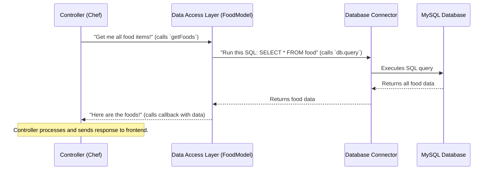

# Chapter 7: Data Access Layer (Models)

Welcome back to the `OrderSystem` project! In our [previous chapter](06_database_connector_.md), we established a crucial link: the **Database Connector**. This connector gave our backend application the "power cable" to talk to our MySQL database. Now that we're connected, the big question is: *how* do our [Backend Logic Handlers (Controllers)](05_backend_logic_handlers__controllers_.md) actually *use* this connection to get the information they need from the database, or store new information?

This is where the **Data Access Layer (Models)** comes into play! These files are like specialized librarians, each knowing exactly how to handle specific types of information in our database.

### What Problem Do Data Access Layer (Models) Solve?

Imagine our [Backend Logic Handler (Controller)](05_backend_logic_handlers__controllers_.md) (the chef) receives an order to "show all food items." The chef knows they need food data, and they know the kitchen has a connection to the pantry (the database) thanks to the [Database Connector](06_database_connector_.md).

But does the chef themselves go into the pantry, remember all the shelf numbers, and know the exact way to fetch specific ingredients? Probably not! That would make the chef's job too complicated, and if the pantry layout changed, the chef would have to relearn everything.

Instead, the chef has specialized **Pantry Staff**. When the chef needs "all food items," they simply tell the "Food Pantry Staff" (our `FoodModel`) to "get all foods." The Food Pantry Staff knows exactly:
*   Which section of the pantry the food items are in (the `food` database table).
*   The precise way to ask for them (the SQL query).
*   How to bring them back.

The **Data Access Layer (Models)** solves the problem of directly talking to the database. They provide a clean, organized way for our controllers to request data without needing to know the complex details of database queries or table structures. Each model acts as a dedicated interface for a specific database table.

**Our Central Use Case:** When the `showFoods` controller (from [Chapter 5: Backend Logic Handlers (Controllers)](05_backend_logic_handlers__controllers_.md)) needs a list of all food items, it doesn't write complex SQL code itself. Instead, it calls a simple function like `getFoods()` from our `FoodModel`. The `FoodModel` then handles all the database interaction to fetch that list.

### Key Concepts

Let's break down the main ideas behind the Data Access Layer (Models):

1.  **Model File:** A JavaScript file (e.g., `FoodModel.js`, `UserModel.js`) that represents a specific database table.
2.  **Database Table:** The actual place in our MySQL database where a certain type of data is stored (e.g., `food` table for food items, `user` table for user accounts).
3.  **CRUD Operations:** Models typically provide functions for the four fundamental database operations:
    *   **C**reate: Adding new records (e.g., `insertFood`).
    *   **R**ead: Querying/fetching data (e.g., `getFoods`, `getFoodById`).
    *   **U**pdate: Modifying existing records (e.g., `updateFoodById`).
    *   **D**elete: Removing records (e.g., `deleteFoodById`).
4.  **SQL Queries:** Models contain the actual Structured Query Language (SQL) commands that are sent to the database to perform CRUD operations.
5.  **Database Connection (`db`):** Models import and use the `db` object provided by our [Database Connector](06_database_connector_.md) to execute their SQL queries.
6.  **Callback Functions:** Models use callback functions to return the results (or any errors) of a database operation back to the calling controller.

### How to Use the Data Access Layer (Models)

Controllers don't directly interact with the database. They interact with Models. Let's revisit our `showFoods` controller and see how it uses the `FoodModel`.

First, the controller needs to import the necessary function from the model:

```javascript
// In backend/controllers/food.js (simplified)

// 1. Import the specific function from our Food Model
import { getFoods } from "../models/FoodModel.js";

// This is our 'showFoods' controller function
export const showFoods = (req, res) => {
    // 2. Call the 'getFoods' function from the FoodModel
    getFoods((err, results) => {
        // 3. The callback function handles the results or errors
        if (err) {
            res.send(err); // If there was an error, send it back
        } else {
            res.json(results); // If successful, send the food data as JSON
        }
    });
};
```
*Explanation:*
-   The line `import { getFoods } from "../models/FoodModel.js";` is how our `showFoods` controller gets access to the `getFoods` function defined in `FoodModel.js`.
-   `getFoods((err, results) => { ... });` is how the controller *uses* the model. It calls the `getFoods` function and provides a **callback function**. This callback function will be executed by the model once it has finished talking to the database and has either `err` (an error occurred) or `results` (the data it fetched).
-   The controller doesn't care *how* `getFoods` gets the data; it just expects the `err` or `results` back. This separation makes our code much cleaner!

### What Happens Under the Hood? (Internal Implementation)

Let's look at the full journey, from the controller asking for food data to the database actually providing it, with the Model acting as the key intermediary.

Imagine our **Model** is the **Pantry Staff** (a specialized librarian).
*   The [Controller](05_backend_logic_handlers__controllers_.md) (the Chef) asks the Pantry Staff.
*   The Pantry Staff (Model) uses the [Database Connector](06_database_connector_.md) (the power cable) to talk to the MySQL Database (the main pantry/library).

Here's the sequence of events when the `showFoods` controller requests all food items:



Now let's dive into the actual code within the `backend/models/` directory to see how Models are structured.

#### `backend/models/FoodModel.js` (Example for Food Items)

This file is responsible for all database operations related to the `food` table.

```javascript
// In backend/models/FoodModel.js

// 1. Import our database connection from the Database Connector
import db from "../config/database.js";

// 2. Function to get all Foods from the 'food' table
export const getFoods = (result) => {
    // db.query sends the SQL command to the database
    db.query("SELECT * FROM food", (err,results)=> {
        if (err){
            console.log(err);
            result(err,null); // If error, pass error back via callback
        }else{
            result(null,results); // If successful, pass results back via callback
        }
    });
};

// 3. Function to get a single Food by its ID
export const getFoodById = (id,result) => {
    db.query("SELECT * FROM food WHERE food_id = ?",[id], (err,results)=> {
        if (err){
            console.log(err);
            result(err,null);
        }else{
            result(null,results[0]); // Return the first result (the single food item)
        }
    });
};

// 4. Function to insert a new Food into the 'food' table
export const insertFood = (data,result) => {
    db.query("INSERT INTO food SET ?",data, (err,results)=> {
        if (err){
            console.log(err);
            result(err,null);
        }else{
            result(null,results[0]); // Return info about the inserted item
        }
    });
};
// ... (other functions for updateFoodById, deleteFoodById follow a similar pattern) ...
```
*Explanation:*
-   **`import db from "../config/database.js";`**: This line is crucial! It imports the active database connection `db` that was set up in [Chapter 6: Database Connector](06_database_connector_.md). Without this, the model wouldn't be able to talk to the database.
-   **`export const getFoods = (result) => { ... };`**: This defines a function that other parts of our application (like controllers) can import and use. The `result` parameter is the callback function that the model will use to send data back.
-   **`db.query("SELECT * FROM food", (err,results)=> { ... });`**: This is the core of the database interaction.
    *   `db.query()` is the method from the `mysql2` library (used by our [Database Connector](06_database_connector_.md)) that executes an SQL command.
    *   `"SELECT * FROM food"` is the actual SQL query to fetch all rows from the `food` table.
    *   `(err, results) => { ... }` is the callback function provided by `db.query`. It will be called by `mysql2` once the database operation is complete. `err` will contain any error messages, and `results` will contain the data returned by the database.
-   **`result(err, null);` or `result(null, results);`**: These lines are where the model calls *its* `result` callback function (the one passed in by the controller) to send back the `err` or `results`. If there's an error, `err` is passed; otherwise, `results` is passed.

#### `backend/models/UserModel.js` (Example for User Operations)

Similarly, `UserModel.js` handles database operations for the `user` table:

```javascript
// In backend/models/UserModel.js

import db from "../config/database.js"; // Import database connection

// Function to get a single user by email
export const getUserByEmail = (data,result) => {
    db.query("SELECT user_id, user_name, user_password FROM user WHERE user_email = ?",[data], (err,results)=> {
        if (err){
            console.log(err);
            result(err,null);
        }else{
            result(null,results[0]); // Return the first user found
        }
    });
};

// Function to insert a new User
export const insertUser = (data,result) => {
    db.query("INSERT INTO user SET ?",data, (err,results)=> {
        if (err){
            console.log(err);
            result(err,null);
        }else{
            result(null,results[0]); // Return info about the inserted user
        }
    });
};
// ... (other functions like getAllUser would follow) ...
```
*Explanation:*
-   The structure is very consistent across all models: import `db`, define functions, use `db.query` with SQL, and handle the callback to return `err` or `results`.
-   Notice how `getUserByEmail` uses `?` as a placeholder in the SQL query and passes `[data]` as the second argument to `db.query`. This is a secure way to pass dynamic values to SQL queries, preventing common security vulnerabilities.

### Conclusion

The **Data Access Layer (Models)** is a fundamental part of our `OrderSystem`'s backend. It acts as the specialized interface to our database, enabling our application to:
-   **Organize database operations** by specific tables (e.g., `FoodModel` for `food` table).
-   **Encapsulate complex SQL queries**, so controllers don't need to know these details.
-   **Provide simple, clear functions** (like `getFoods`, `insertUser`) for controllers to interact with the database.
-   **Use the database connection** provided by the [Database Connector](06_database_connector_.md) to execute these operations.

By having this layer, our backend code becomes much cleaner, more organized, and easier to maintain. This concludes our journey through the `OrderSystem`'s architecture, from the frontend user interface all the way down to how we interact with our database!

---

<sub><sup>Generated by [AI Codebase Knowledge Builder](https://github.com/The-Pocket/Tutorial-Codebase-Knowledge).</sup></sub> <sub><sup>**References**: [[1]](https://github.com/kuryudesu/OrderSystem/blob/01f52feb1b4ca4685d272f4a74adb2bb997f06bb/backend/models/BillDetailsModel.js), [[2]](https://github.com/kuryudesu/OrderSystem/blob/01f52feb1b4ca4685d272f4a74adb2bb997f06bb/backend/models/BillStatusModel.js), [[3]](https://github.com/kuryudesu/OrderSystem/blob/01f52feb1b4ca4685d272f4a74adb2bb997f06bb/backend/models/BookTableModel.js), [[4]](https://github.com/kuryudesu/OrderSystem/blob/01f52feb1b4ca4685d272f4a74adb2bb997f06bb/backend/models/CartModel.js), [[5]](https://github.com/kuryudesu/OrderSystem/blob/01f52feb1b4ca4685d272f4a74adb2bb997f06bb/backend/models/FoodModel.js), [[6]](https://github.com/kuryudesu/OrderSystem/blob/01f52feb1b4ca4685d272f4a74adb2bb997f06bb/backend/models/SeatModel.js), [[7]](https://github.com/kuryudesu/OrderSystem/blob/01f52feb1b4ca4685d272f4a74adb2bb997f06bb/backend/models/StaffModel.js), [[8]](https://github.com/kuryudesu/OrderSystem/blob/01f52feb1b4ca4685d272f4a74adb2bb997f06bb/backend/models/UserModel.js)</sup></sub>
