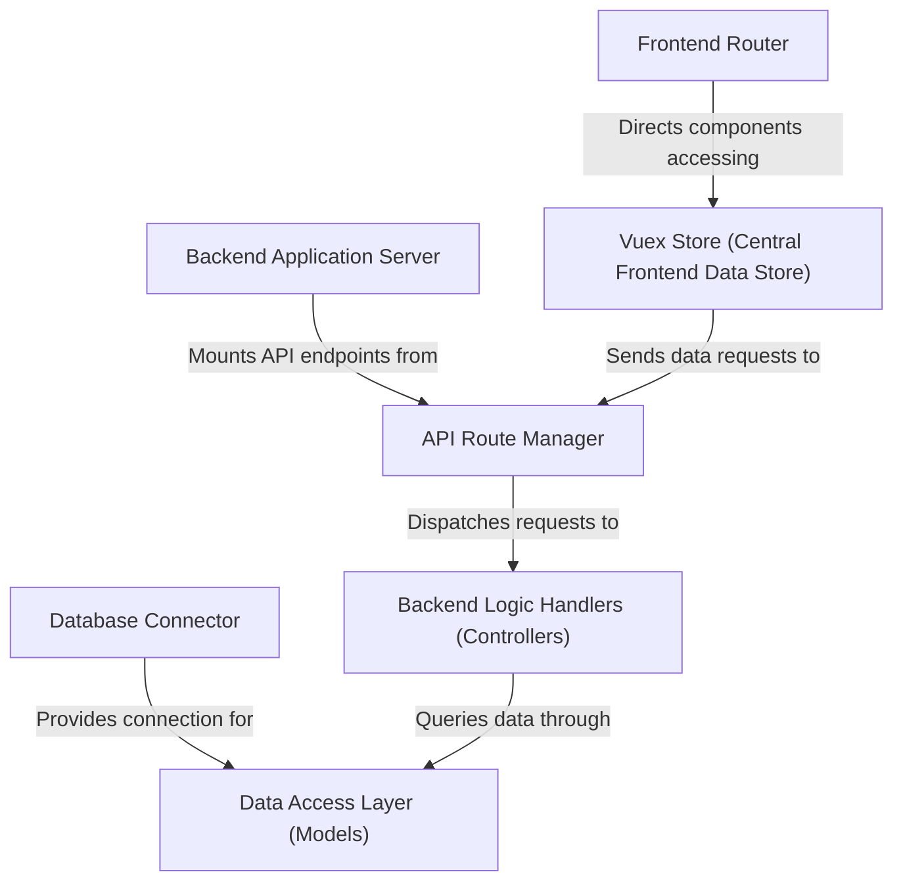

# Tutorial: OrderSystem

This project is an **online restaurant ordering system** that allows *customers to browse a menu*, add items to a cart, and *place food orders* for pickup or dining in. It also enables users to *book tables* and manage their orders. The system has a backend that handles data management and business logic via a REST API, and a frontend that provides an interactive user interface for a seamless ordering experience.

## Visual Overview

## Chapters

1. [Frontend Router
](01_frontend_router_.md)
2. [Vuex Store (Central Frontend Data Store)
](02_vuex_store__central_frontend_data_store__.md)
3. [Backend Application Server
](03_backend_application_server_.md)
4. [API Route Manager
](04_api_route_manager_.md)
5. [Backend Logic Handlers (Controllers)
](05_backend_logic_handlers__controllers__.md)
6. [Database Connector
](06_database_connector_.md)
7. [Data Access Layer (Models)
](07_data_access_layer__models__.md)

---

Generated by [AI Codebase Knowledge Builder](https://github.com/The-Pocket/Tutorial-Codebase-Knowledge).
